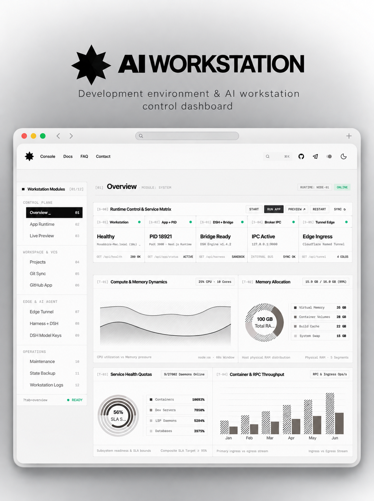

<p align="center">
  
</p>

<h1 align="center">AI Workstation</h1>

<p align="center">
  The standalone, production-ready Next.js web application for AI Workstation — providing a direct visual control plane, live telemetry monitoring, project hot-swapping, Git sync controls, and complete documentation.
  <br />
  <em>Looking for the CLI backend? Check out the <a href="https://github.com/mosabbir-maruf/ai-workstation-cli">AI Workstation CLI</a>.</em>
</p>

<p align="center">
  <a href="https://github.com/mosabbir-maruf/ai-workstation/actions/workflows/ci.yml"></a>
  <a href="https://github.com/mosabbir-maruf/ai-workstation/pkgs/container/ai-workstation"></a>
  <a href="LICENSE"></a>
</p>

<p align="center">
  
</p>

---

## Architecture

This frontend is designed to run as an independent web application that communicates with the `ai-workstation` daemon through a configurable HTTP/SSE API:

```
┌─────────────────────────────────┐
│   Web Browser / Client Device   │
└────────────────┬────────────────┘
                 │
                 │ HTTP (REST) / SSE (EventStream)
                 ▼
┌─────────────────────────────────┐
│   Next.js Frontend (Web GUI)    │ ◀── Standalone Next.js 16 (App Router)
│   (Vercel / Docker / Node host) │
└────────────────┬────────────────┘
                 │
                 │ Configurable via NEXT_PUBLIC_API_URL
                 ▼
┌─────────────────────────────────┐
│    AI Workstation Backend/API   │ ◀── Separate CLI/daemon repository
│    (VPS / Local Machine)        │     (https://github.com/mosabbir-maruf/ai-workstation-cli)
└────────────────┬────────────────┘
                 │
                 ├── Docker Engine & Isolation Containers
                 ├── DeepSeek Harness (DSH Engine)
                 ├── GitHub App Credential Broker (Unix socket)
                 └── Cloudflare Zero Trust Ingress Tunnel
```

### Relationship Between Repositories

| Repository | Purpose | Primary Interface |
| :--- | :--- | :--- |
| **[ai-workstation-cli](https://github.com/mosabbir-maruf/ai-workstation-cli)** | Backend daemon, container harness, and CLI engine | Terminal CLI (`ai`) |
| **[ai-workstation](https://github.com/mosabbir-maruf/ai-workstation)** | Graphical web console, live telemetry, and documentation | Web Browser (`/workstation`, `/docs`) |

- **CLI-only users**: Can use the backend `ai-workstation-cli` repository directly without the web frontend.
- **Web Console users**: Can run or deploy this frontend to manage their workstation graphically against their remote VPS or local backend.

---

## Features

- **Workstation Console (`/workstation`)**:
  - **Overview**: 5-service health status, live CPU/RAM wave dynamics, memory allocation pie chart, SLA ring gauges, and throughput bar charts.
  - **App Runtime**: Process supervisor controls (Run, Stop, Restart), PID monitoring, and live stdout/stderr stream viewer.
  - **Live Preview**: Dual endpoint ingress (Public Edge and Local Origin), embedded 16:9 interactive viewport sandbox.
  - **Projects**: Workspace registry, hot-swapping active projects without container restarts, Git cloning and mounting.
  - **Git Sync**: Pull with fast-forward verification, secret-guarded commit and push controls.
  - **GitHub App**: Zero-PAT Unix domain socket broker credential management and authentication testing.
  - **Edge Tunnel**: Cloudflare Zero Trust tunnel setup, ingress route management, and token configuration.
  - **Harness + DSH**: DeepSeek Harness agent engine supervisor, runtime version management, and in-place upgrades.
  - **DSH Model Keys**: Encrypted configuration manager for DeepSeek, OpenAI, and Anthropic API keys.
  - **Maintenance**: Docker build cache and stale dependency pruning, system updates, and diagnostic doctor checks.
  - **State Backup**: Off-site export and import of full workstation conversation history and workspace state.
  - **Workstation Logs**: Dual-channel real-time Server-Sent Events (SSE) telemetry log streams with buffer control.
- **Documentation Portal (`/docs`)**: Interactive guides, architecture references, and security manuals powered by Fumadocs MDX.
- **Showcase Landing Page (`/`)**: Interactive architectural canvas, telemetry preview, workflow masonry, and partner ecosystem.

---

## Requirements

- **Node.js**: `>= 20.0.0`
- **Package Manager**: `pnpm >= 9.0.0`
- **Docker** (optional): For containerized deployments
- **Backend Service**: Running instance of [ai-workstation-cli](https://github.com/mosabbir-maruf/ai-workstation-cli)

---

## Local Development

1. **Clone the repository**:
   ```bash
   git clone https://github.com/mosabbir-maruf/ai-workstation.git
   cd ai-workstation
   ```

2. **Install dependencies**:
   ```bash
   pnpm install --frozen-lockfile
   ```

3. **Configure environment**:
   ```bash
   cp .env.example .env.local
   ```
   Set `NEXT_PUBLIC_API_URL` to point to your `ai-workstation` instance (e.g. `http://localhost:8000` or leave empty for same-origin).

4. **Start development server**:
   ```bash
   pnpm dev
   ```
   Open [http://localhost:3000](http://localhost:3000) in your browser.

---

## Backend Connection Scenarios

The frontend connects to the backend through the configurable `NEXT_PUBLIC_API_URL` environment variable:

### Scenario 1: Local Frontend → Local Backend
Both the Next.js app and the `ai-workstation` daemon run on your local machine:
```env
NEXT_PUBLIC_API_URL=http://localhost:8000
```

### Scenario 2: Local Frontend → Remote VPS Backend
The frontend runs locally while connecting securely to an `ai-workstation` instance running on a VPS:
```env
NEXT_PUBLIC_API_URL=https://api.workstation.yourdomain.com
```

### Scenario 3: Hosted Frontend → Remote VPS Backend
The frontend is deployed to Vercel, Cloudflare Pages, or a separate server, and connects cross-origin to the backend:
```env
NEXT_PUBLIC_API_URL=https://api.workstation.yourdomain.com
```

### Scenario 4: Collocated Deployment (Reverse Proxy)
Frontend and backend are served behind the same reverse proxy (e.g. Nginx, Caddy, or Cloudflare Tunnel) on the same origin:
```env
NEXT_PUBLIC_API_URL=
```
*(Leave empty to route requests via relative `/api/*` endpoints).*

---

## CORS & Cross-Origin Security

When the frontend and backend are hosted on different origins:
1. The backend must allow the frontend's origin via the `ALLOWED_HOSTS` configuration or specific CORS headers (`Access-Control-Allow-Origin: https://frontend.yourdomain.com`).
2. Do **NOT** use `Access-Control-Allow-Origin: *` in production environments handling private workstation operations.
3. The frontend passes standard headers (`Content-Type: application/json`, `Accept: application/json`) and never exposes private tokens or host SSH keys to browser bundles.

---

## Production Deployment

### Option A: Docker Deployment (Recommended)

1. **Pull the official container image**:
   ```bash
   docker pull ghcr.io/mosabbir-maruf/ai-workstation:latest
   ```

2. **Run the container**:
   ```bash
   docker run -d \
     --name ai-workstation \
     --restart unless-stopped \
     -p 3000:3000 \
     -e NEXT_PUBLIC_API_URL=https://api.workstation.yourdomain.com \
     -e NEXT_PUBLIC_SITE_URL=https://workstation.yourdomain.com \
     ghcr.io/mosabbir-maruf/ai-workstation:latest
   ```

3. **Or build locally**:
   ```bash
   docker build -t ai-workstation .
   docker run -p 3000:3000 ai-workstation
   ```

### Option B: Node.js Standalone Server

```bash
pnpm build
node .next/standalone/server.js
```

---

## CI/CD Pipeline

The GitHub Actions workflow (`.github/workflows/ci.yml`) automates verification and publishing:

1. **Code Quality Checks**:
   - Dependency validation with frozen lockfile (`pnpm install --frozen-lockfile`)
   - ESLint static analysis (`pnpm lint`)
   - TypeScript compilation check (`pnpm typecheck`)
   - Unit tests (`pnpm test`)
   - Next.js production build (`pnpm build`)
2. **Docker Build Validation**: Verifies the container build on every pull request.
3. **Publish to GitHub Container Registry (GHCR)**:
   - Publishes to `ghcr.io/<owner>/ai-workstation` on pushes to `main` and release tags (`v*.*.*`).
   - Image tags: `latest`, `sha-<short_sha>`, and semver tags.
4. **Safe Image Retention Policy**:
   - Retains strictly **`latest`** and the **previous release image** for safe rollbacks.
   - Automatically prunes older stale images using `actions/delete-package-versions`.
   - Never removes `latest` or the current active release.

---

## Verification & Scripts

```bash
# Code linting
pnpm lint

# TypeScript verification
pnpm typecheck

# Unit testing
pnpm test

# Production build
pnpm build

# Start production server
pnpm start
```

---

## License

This project is licensed under the MIT License. See [LICENSE](https://github.com/mosabbir-maruf/ai-workstation/blob/main/LICENSE) for the full license text.

---

## Maintainer

Developed and maintained by [**Mosabbir Maruf**](https://github.com/mosabbir-maruf).

[](https://github.com/mosabbir-maruf)
