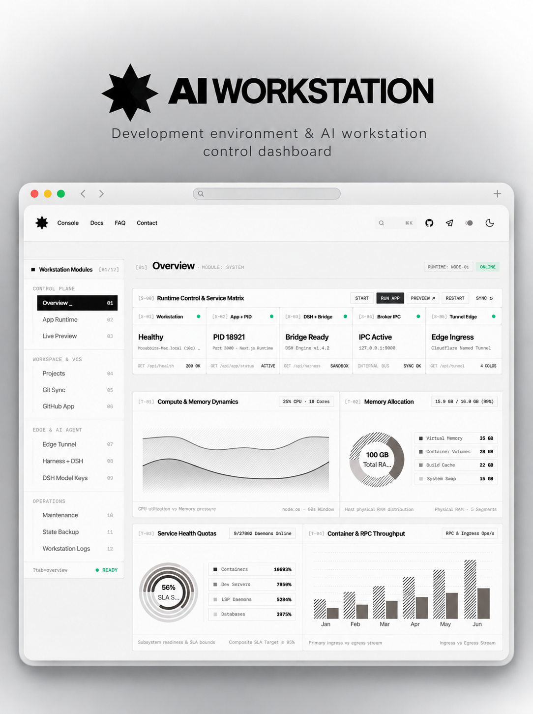

<p align="center">
  
</p>

<h1 align="center">AIWS</h1>

<p align="center">
  The standalone, production-ready Next.js web application for AIWS — providing a direct visual control plane, live telemetry monitoring, project hot-swapping, Git sync controls, and complete documentation.
  <br />
  <em>Looking for the CLI backend? Check out the <a href="https://github.com/mosabbir-maruf/aiws-cli">AIWS CLI</a>.</em>
</p>

<p align="center">
  <a href="https://github.com/mosabbir-maruf/ai-workstation/actions/workflows/ci.yml"></a>
  <a href="https://github.com/mosabbir-maruf/aiws/pkgs/container/aiws"></a>
  <a href="LICENSE"></a>
  <a href="https://github.com/mosabbir-maruf"></a>
</p>

<p align="center">
  
</p>

---

## Architecture

This frontend is designed to run as an independent web application that communicates with the `aiws` daemon through a configurable HTTP/SSE API:

```
┌─────────────────────────────────┐
│   Web Browser / Client Device   │
└────────────────┬────────────────┘
                 │
                 │ HTTP (REST) / SSE (EventStream)
                 ▼
┌─────────────────────────────────┐
│   Next.js Frontend (Web GUI)    │ ◀── Standalone Next.js 16 (App Router + proxy.ts)
│   (Vercel / Railway / Docker)   │     Protected by Web Crypto HMAC Authentication Gate
└────────────────┬────────────────┘
                 │
                 │ Authenticated Backend Proxy (Bearer WORKSTATION_API_KEY)
                 ▼
┌─────────────────────────────────┐
│    AIWS Backend/API   │ ◀── Separate CLI/daemon repository
│    (VPS / Local Machine)        │     (https://github.com/mosabbir-maruf/aiws-cli)
└────────────────┬────────────────┘
                 │
                 ├── Docker Engine & Isolation Containers
                 ├── DeepSeek Harness (DSH Engine)
                 ├── GitHub App Credential Broker (Unix socket)
                 └── Cloudflare Zero Trust Ingress Tunnel
```

### Relationship Between Repositories

| Repository | Purpose | Primary Interface |
| :--- | :--- | :--- |
| **[aiws-cli](https://github.com/mosabbir-maruf/aiws-cli)** | Backend daemon, container harness, and CLI engine | Terminal CLI (`aiws`) |
| **[aiws](https://github.com/mosabbir-maruf/aiws)** | Graphical web console, live telemetry, and documentation | Web Browser (`/workstation`, `/docs`) |

- **CLI-only users**: Can use the backend `aiws-cli` repository directly without the web frontend.
- **Web Console users**: Can run or deploy this frontend to manage their workstation graphically against their remote VPS or local backend.

---

## Features

- **Workstation Console (`/workstation`)**:
  - **Overview**: 5-service health status, live CPU/RAM wave dynamics, memory allocation pie chart, SLA ring gauges, and throughput bar charts.
  - **App Runtime**: Process supervisor controls (Run, Stop, Restart), PID monitoring, and live stdout/stderr stream viewer.
  - **Live Preview**: Dual endpoint ingress (Public Edge and Local Origin), embedded 16:9 interactive viewport sandbox.
  - **Projects**: Workspace registry, hot-swapping active projects without container restarts, Git cloning and mounting.
  - **Git Sync**: Pull with fast-forward verification, secret-guarded commit and push controls.
  - **GitHub App**: Zero-PAT Unix domain socket broker credential management and authentication testing.
  - **Edge Tunnel**: Cloudflare Zero Trust tunnel setup, ingress route management, and token configuration.
  - **Harness + DSH**: DeepSeek Harness agent engine supervisor, runtime version management, and in-place upgrades.
  - **DSH Model Keys**: Encrypted configuration manager for DeepSeek, OpenAI, and Anthropic API keys.
  - **Maintenance**: Docker build cache and stale dependency pruning, system updates, and diagnostic doctor checks.
  - **State Backup**: Off-site export and import of full workstation conversation history and workspace state.
  - **Workstation Logs**: Dual-channel real-time Server-Sent Events (SSE) telemetry log streams with buffer control.
- **Documentation Portal (`/docs`)**: Interactive guides, architecture references, and security manuals powered by Fumadocs MDX.
- **Showcase Landing Page (`/`)**: Interactive architectural canvas, telemetry preview, workflow masonry, and partner ecosystem.

---

## Requirements

- **Node.js**: `>= 20.0.0`
- **Package Manager**: `pnpm >= 9.0.0`
- **Docker** (optional): For containerized deployments
- **Backend Service**: Running instance of [aiws-cli](https://github.com/mosabbir-maruf/aiws-cli)

---

## Local Development

1. **Clone the repository**:
   ```bash
   git clone https://github.com/mosabbir-maruf/aiws.git
   cd aiws
   ```

2. **Install dependencies**:
   ```bash
   pnpm install --frozen-lockfile
   ```

3. **Configure environment**:
   ```bash
   cp .env.example .env.local
   ```
   Configure your environment variables:
   - `WORKSTATION_PASSWORD`: Master passphrase to unlock the `/workstation` console.
   - `WORKSTATION_API_KEY`: Server-side Bearer token matching your `aiws` daemon.
   - `WORKSTATION_BACKEND_URL`: Internal address (e.g. `http://127.0.0.1:8000`).
   - `NEXT_PUBLIC_API_URL`: Optional public API endpoint for cross-origin setups.

4. **Start development server**:
   ```bash
   pnpm dev
   ```
   Open [http://localhost:3000](http://localhost:3000) in your browser.

---

## Operator Authentication & Security Gate

The Web Console (`/workstation`) and its management routes (`/api/*`) are protected by a built-in cryptographic security gate implemented in [`proxy.ts`](proxy.ts) using the Web Crypto API:

- **Login Gateway (`/login`)**: Visiting `/workstation` without an active session automatically redirects to a CAD-styled login portal.
- **HMAC-SHA256 Signed Sessions**: Upon entering the `WORKSTATION_PASSWORD` (or `WORKSTATION_API_KEY`), the server issues an encrypted, tamper-proof session cookie (`aiws_session`).
- **Timing-Attack Immune**: All password comparisons use constant-time byte verification (`timingSafeEqual`) to prevent side-channel timing attacks.
- **Brute-Force Rate Limiting**: The login endpoint allows a maximum of 5 attempts per 60 seconds per IP, returning `429 Too Many Requests` on abuse.
- **Strict Cookie Flags**: Cookies are strictly configured with `HttpOnly` (inaccessible to browser JavaScript), `SameSite=Lax`, and `Secure` (in production).
- **Public Surface Whitelist**: The landing page (`/`), documentation (`/docs/*`), FAQ (`/faq`), and contact page (`/contact`) remain public and open.
- **Direct Bearer Access**: Automated tools or CLI scripts can bypass the cookie gate by providing an `Authorization: Bearer <WORKSTATION_API_KEY>` header directly to `/api/*`.

---

## Backend Connection Scenarios

### Scenario 1: Collocated / Reverse Proxy (Recommended)
Frontend and backend daemon run on the same machine, or Next.js acts as the server-side proxy using `WORKSTATION_BACKEND_URL`:
```env
WORKSTATION_BACKEND_URL=http://127.0.0.1:8000
WORKSTATION_API_KEY=your-daemon-api-key
WORKSTATION_PASSWORD=your-console-password
```

### Scenario 2: Remote VPS Backend via Cloudflare Tunnel
The frontend runs on a managed host (Vercel, Railway, or Docker) and proxies to an `aiws` daemon exposed via a private Cloudflare Tunnel:
```env
WORKSTATION_BACKEND_URL=https://api.workstation.yourdomain.com
WORKSTATION_API_KEY=your-daemon-api-key
WORKSTATION_PASSWORD=your-console-password
```

### Scenario 3: Local Frontend → Remote VPS
Running Next.js locally on your workstation connecting to your remote cloud daemon:
```env
WORKSTATION_BACKEND_URL=https://api.workstation.yourdomain.com
WORKSTATION_API_KEY=your-daemon-api-key
WORKSTATION_PASSWORD=your-console-password
```

---

## Environment Variables Reference

| Variable | Scope | Purpose | Example |
| :--- | :--- | :--- | :--- |
| `WORKSTATION_PASSWORD` | Server-only | Master passphrase for `/login` gate | `super-secret-passphrase` |
| `WORKSTATION_API_KEY` | Server-only | Daemon Bearer token for `/api/*` proxies | `daemon-secret-key` |
| `WORKSTATION_BACKEND_URL`| Server-only | Internal URL to `aiws` daemon | `http://127.0.0.1:8000` |
| `NEXT_PUBLIC_API_URL` | Client/Server| Public API fallback URL (optional) | `https://api.workstation.yourdomain.com` |
| `NEXT_PUBLIC_SITE_URL` | Client/Server| Canonical website URL for SEO | `https://workstation.yourdomain.com` |

---

## CORS & Cross-Origin Security

When the frontend and backend are hosted on different origins:
1. The backend must allow the frontend's origin via `ALLOWED_HOSTS` or CORS headers (`Access-Control-Allow-Origin: https://frontend.yourdomain.com`).
2. Do **NOT** use `Access-Control-Allow-Origin: *` in production environments handling private workstation operations.
3. Secret tokens (`WORKSTATION_API_KEY` and `WORKSTATION_PASSWORD`) are strictly server-side and are **never** bundled into browser JavaScript.

---

## Production Deployment

### Option A: Docker Deployment (Recommended)

1. **Pull the official container image**:
   ```bash
   docker pull ghcr.io/mosabbir-maruf/aiws:latest
   ```

2. **Run the container**:
   ```bash
   docker run -d \
     --name aiws \
     --restart unless-stopped \
     -p 3000:3000 \
     -e NEXT_PUBLIC_API_URL=https://api.workstation.yourdomain.com \
     -e NEXT_PUBLIC_SITE_URL=https://workstation.yourdomain.com \
     ghcr.io/mosabbir-maruf/aiws:latest
   ```

3. **Or build locally**:
   ```bash
   docker build -t aiws .
   docker run -p 3000:3000 aiws
   ```

### Option B: Node.js Standalone Server

```bash
pnpm build
node .next/standalone/server.js
```

---

## CI/CD Pipeline

The GitHub Actions workflow (`.github/workflows/ci.yml`) automates verification and publishing:

1. **Code Quality Checks**:
   - Dependency validation with frozen lockfile (`pnpm install --frozen-lockfile`)
   - ESLint static analysis (`pnpm lint`)
   - TypeScript compilation check (`pnpm typecheck`)
   - Unit tests (`pnpm test`)
   - Next.js production build (`pnpm build`)
2. **Docker Build Validation**: Verifies the container build on every pull request.
3. **Publish to GitHub Container Registry (GHCR)**:
   - Publishes to `ghcr.io/<owner>/aiws` on pushes to `main` and release tags (`v*.*.*`).
   - Image tags: `latest`, `sha-<short_sha>`, and semver tags.
4. **Safe Image Retention Policy**:
   - Retains strictly **`latest`** and the **previous release image** for safe rollbacks.
   - Automatically prunes older stale images using `actions/delete-package-versions`.
   - Never removes `latest` or the current active release.

---

## Verification & Scripts

```bash
# Code linting
pnpm lint

# TypeScript verification
pnpm typecheck

# Unit testing
pnpm test

# Production build
pnpm build

# Start production server
pnpm start
```

---

## License

This project is licensed under the MIT License. See [LICENSE](https://github.com/mosabbir-maruf/aiws/blob/main/LICENSE) for the full license text.

---

## Maintainer

Developed and maintained by [**Mosabbir Maruf**](https://github.com/mosabbir-maruf).

[](https://github.com/mosabbir-maruf)
